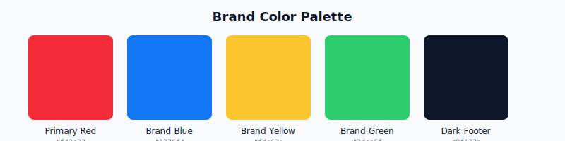

# Digital Products Store — Dynamic E-commerce MVP

<div align="center">


**A dynamic digital products e-commerce MVP with admin dashboard and Supabase backend.**

[Features](#features) • [Tech Stack](#tech-stack) • [Getting Started](#getting-started) • [Supabase Setup](#supabase-setup) • [Project Structure](#project-structure)

</div>

---

## Visual Preview

### Homepage


### Product Catalog


### Product Details


### Admin Dashboard


### Cart & Checkout


---

## Color Palette

| Color | Hex | Usage |
|-------|-----|-------|
| **Primary Red** | `#f42c37` | CTAs, hero, primary actions |
| **Brand Blue** | `#1376f4` | Links, secondary actions |
| **Brand Yellow** | `#fdc62e` | Highlights, badges |
| **Brand Green** | `#2dcc6f` | Success states, confirmations |
| **Dark Footer** | `#0f172a` | Footer background |
| **Light Background** | `#f8fafc` | Page backgrounds |



---

## Features

### Storefront
- Modern landing page with hero section and benefits
- Dynamic product listing from Supabase database
- Product detail pages with slug-based routing
- Category browsing and filtering
- Featured products section
- Shopping cart with Zustand state management
- Demo checkout flow
- Fully responsive design (mobile, tablet, desktop)

### Admin Dashboard
- Protected admin routes (login required)
- Role-based access control (`is_admin` flag)
- Full product CRUD operations
- Category management (create, edit, delete)
- Product status control (active, inactive, archived)
- Featured product toggle
- Instant download toggle
- View statistics (views, downloads)

### Supabase Backend
- PostgreSQL database with full schema
- User authentication (signup, login, session management)
- Pre-built seed data with 8+ digital products
- Row Level Security (RLS) policies documented
- Ready for Supabase Storage integration
- Ready for payment provider integration

---

## Tech Stack

| Technology | Purpose |
|------------|---------|
| **Next.js 16** | React framework with App Router |
| **TypeScript** | Type-safe JavaScript |
| **Tailwind CSS** | Utility-first styling |
| **shadcn/ui** | Reusable UI components |
| **Supabase** | PostgreSQL database, Auth, Storage-ready |
| **Zustand** | Lightweight state management for cart |
| **React Hook Form + Zod** | Form handling and validation |
| **Vercel** | Deployment platform |

---

## Getting Started

### Prerequisites

- Node.js 18+
- npm or pnpm
- A Supabase project (free tier works)

### Installation

```bash
# Using npm
npm install
npm run dev

# Using pnpm
pnpm install
pnpm dev
```

Open [http://localhost:3000](http://localhost:3000) in your browser.

---

## Environment Variables

Create a `.env.local` file in the project root:

```env
NEXT_PUBLIC_SUPABASE_URL=your_supabase_project_url
NEXT_PUBLIC_SUPABASE_ANON_KEY=your_supabase_anon_key
```

Get these values from your [Supabase Dashboard](https://supabase.com/dashboard) → Settings → API.

---

## Supabase Setup

### 1. Run Database Schema

1. Go to your Supabase project → SQL Editor
2. Copy and paste the contents of `supabase/schema.sql`
3. Click "Run" to create all tables and functions

### 2. Seed Demo Data (Optional)

The schema.sql already includes seed data. To run separately:

1. Go to SQL Editor
2. Copy and paste `supabase/seed.sql`
3. Click "Run"

This creates:
- 4 Categories: Templates, Business, Marketing, Design
- 8 Digital Products with realistic data

### 3. Create Admin User

1. Go to `/auth/sign-up` and create an account
2. In Supabase SQL Editor, run:

```sql
UPDATE public.profiles
SET is_admin = TRUE
WHERE email = 'your-email@example.com';
```

3. Refresh your app — you now see the "Admin" link in the navbar

---

## Project Structure

```
├── app/                        # Next.js App Router
│   ├── admin/                  # Admin dashboard pages
│   │   ├── products/           # Product management (list, create, edit)
│   │   └── categories/         # Category management
│   ├── auth/                   # Authentication pages
│   │   ├── login/
│   │   ├── sign-up/
│   │   └── callback/           # OAuth callback handler
│   ├── cart/                   # Shopping cart
│   ├── checkout/                # Demo checkout
│   ├── products/[slug]/        # Product detail pages
│   ├── category/[slug]/        # Category listing pages
│   └── order-confirmation/[id]/ # Order confirmation
├── components/                 # React components
│   ├── admin/                  # Admin-specific components
│   ├── ui/                     # shadcn/ui components
│   ├── navbar.tsx              # Navigation
│   ├── footer.tsx              # Footer
│   ├── cart-provider.tsx       # Cart context
│   └── product-card.tsx        # Product card
├── lib/                        # Library code
│   ├── db/                     # Database queries
│   │   ├── products.ts
│   │   ├── categories.ts
│   │   └── orders.ts
│   ├── supabase/               # Supabase clients
│   │   ├── client.ts           # Browser client
│   │   ├── server.ts           # Server client
│   │   └── proxy.ts            # Middleware proxy
│   ├── store/                  # State management
│   │   └── cart.ts             # Zustand cart store
│   └── types.ts                # TypeScript types
├── hooks/                      # Custom React hooks
├── docs/                       # Documentation
│   └── assets/                 # Screenshots, diagrams
├── supabase/                   # SQL files
│   ├── schema.sql              # Database schema + seed
│   └── seed.sql                # Seed data only
└── public/                     # Static assets
```

---

## Demo Scope

### ✅ Implemented Now

- Dynamic products and categories from Supabase
- Admin dashboard with product/category management
- Shopping cart with persistent state
- Demo checkout flow (simulated, no real payment)
- User authentication (signup, login, logout)
- Role-based admin access
- Responsive storefront design
- Product slug-based routing

### 🔄 Future Production Phase

- Stripe or Paddle payment integration
- Secure file downloads via Supabase Storage with signed URLs
- Email order confirmations
- User download history
- Product search and filtering
- Discount/promo code system
- Order tracking
- Email notifications

---

## Client Presentation Note

This MVP demonstrates how a static storefront can evolve into a real digital products platform. The admin dashboard allows non-technical users to manage products and categories directly from the database, while the Supabase backend provides a scalable foundation ready for payment processing, secure file delivery, and additional features.

---

## License

MIT License — Free to use for personal and commercial projects.

---

<div align="center">

**Built with [Next.js](https://nextjs.org) + [Supabase](https://supabase.com)**

</div>
